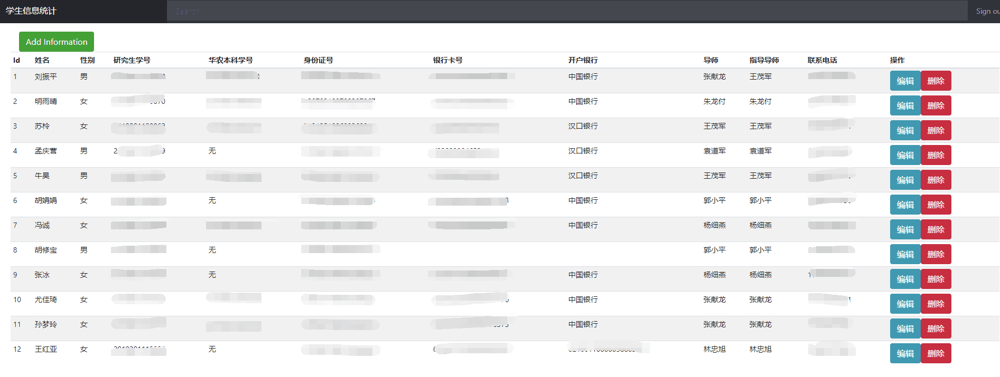

# curd增删改查的使用


> :warning: linux服务器端口号的问题

```shell
netstat -anp|grep 8080
```

### 基于文件的增删改查

+ 基于fs读取json数据文件
+ 使用express-art-template模板引擎，发送模板页面和填充模板数据
+ 将json文件字符串解析成json格式

```javascript
var app=express() //init server
app.engine('html', require('express-art-template')) 
app.set('views','/var/www/html/node/express_demo/public/');

app.get("/",function(req,rep){ //request root url
	/*rep.send("hello express")*/ //response the client
	/*rep.send("中文 is ok!")*/ //response the client with chinese
	fs.readFile("./data/test.json",function(err,data){
		if(err){
			rep.status(500).send("server error")
			console.log("读取文件失败");
			return
		}
		rep.render("index.html",{
		category:JSON.parse(data.toString()).category,
		tiem:JSON.parse(data.toString()).time,
		individual:JSON.parse(data.toString()).individual
	})
	});
})
```


  + 使用art-template填充语法,对模板文件进行填充

    ```javascript
    <tbody>
                    {{ each individual}}
                    <tr>
                      <td>{{ $value.id }}</td>
                      <td>{{ $value.name }}</td>
                      <td>{{ $value.hobbies }}</td>
                      <td>{{ $value.sports }}</td>
                      <td>sit</td>
                    </tr>
                    {{ /each }}
                  </tbody>
    ```

    

    

+ ### 基于API对数据进行操作

  	> 将对学生数据进行操作的代码进行封装，由于涉及到文件的异步操作，这里也使用到了回调函数获取异步读取文件的数据

  ### 读取操作

```javascript
 var dbpath="./data/test.json"
 /*
获取所有学生的列表
return []

通过回掉函数获取读取的文件信息,
当调用find函数时，传入函数作为参数，将异步获取到的数据发送给回调函数，在回调函数中展示出来
 */
exports.find=function(callback){
	fs.readFile(dbpath,function(err,data){
		if(err){
			callback(err)
		}
		callback(null,JSON.parse(data.toString()))
	})
```


> 通过调用回掉函数获取，文件数据

```javascript
//err与data是传入回调函数的形参
var Student=require("./students.js")
	Student.find(function(err,data){
		if(err){
			rep.status(500).send("server error")
			console.log("读取文件失败");
			return
		}
		rep.render("students.html",{
		category:data.category,
		tiem:data.time,
		individual:data.individual
	})
});
```


 + ##### 添加操作

   + 涉及文件的读取与写入操作

   + JSON数据的整理

   + 回调函数的处理

     

```javascript
/*
添加并且保存学生信息,
传入参数是一个学生的信息，使用回调函数获取查询的状态
 */
exports.saveStudent=function(student,callback){
	fs.readFile(dbpath,function(err,data){
		if(err){
			return callback(err) //必须return 结束函数的运行
		}
		/*获取文件中所有学生的列表*/
		var students=JSON.parse(data.toString()).individual;
		/*处理好id信息*/
		student.id=students[students.length-1].id+1;
		students.push(student)
		var filedata=JSON.stringify({
			category:JSON.parse(data.toString()).category,
			time:JSON.parse(data.toString()).time,
			individual:students
		})
		fs.writeFile(dbpath,filedata,function(err){
			if(err){
				//传递文件写入错误对象
				 return callback(err)
			}
			callback(null)
		})
	})
}

```

 + API调用接口,使用body-parser获取post数据

   ```javascript
   router.post("/students/new",function(req,rep){
   /*获取到post数据，将数据保存到文件中*/	
   	student={
   		name:req.body.name,
   		hobbies:req.body.hobbies,
   		sports:req.body.sports}	
   	Student.saveStudent(student,function(err){
   		if(err){
   			console.log(err)
   			rep.send("写入错误！")
   		}
   	})	
   	rep.redirect('/')
   	rep.send()
   })
   ```

   

+ ## 更新操作

  + 基于GET对单个数据进行查询操作
  + 单个数据的渲染操作
  + 基于POST对数据进行更新

  ```javascript
  //使用GET方法请求更新页面，在解析GET参数时，由于后面会使用到加法算ID，所以将GET的id解析为数字
  router.get("/student/update",function(req,rep){
  	Student.findById(parseInt(req.query.id),function(err,ret){
  		if(err){
  			rep.send("server error")
  		}
  		rep.render("edite.html",{
  			check:"checked",
  			student:ret
  		})
  	})
  })
  
  //在Student类中封装好了查询单个数据的函数
  exports.findById=function(id,callback){
  		fs.readFile(dbpath,function(err,data){
  		if(err){
  			callback(err)
  		}
  		var students=JSON.parse(data.toString()).individual;
  		var ret=students.find(function(item){
  			return item.id===id
  		})
  		callback(null,ret)
  	})
  }
  //通过callback回调函数获取到查询的结果，使用find函数进行类似字典的遍历
  ```

  + ###### 跳转到编辑页面后，进行POST请求更新页面

     **POST**请求只需传递POST表单给服务器，错误则响应错误，否则进行重定向

    ```javascript
    router.post("/student/update",function(req,rep){
    	Student.updateStudent(req.body,function(err){
    		if(err){
    			rep.send("server error!")
    		}
    		rep.redirect("/")
    	})
    })
    //封装好的更新函数，通过获取对应id对象后，使用for循环将数据更新
    
    ```

    **在数据更新的时候由于POST表单有些键值是以字符串方式进行存储的与文件中存储的类型可能会有冲突，需要将变量类型进行一定的转换**

    ```javascript
    exports.updateStudent=function(updateByID,callback){
    	fs.readFile(dbpath,function(err,data){
    		if(err){
    			callback(err)
    		}
    		var students=JSON.parse(data.toString()).individual;
    		updateByID.id=parseInt(updateByID.id) //表单提交的是字符串
    		updateByID.gender=parseInt(updateByID.gender) //表单提交的是字符串
    		/*ES6的find函数返回函数对象,使用引用类型*/
    		var updateitem=students.find(function(item){
    			return item.id===updateByID.id 
    		})
    		for(var key in updateitem){ //这里遍历的时候，当添加了新的数据项的时候需要换成提交的表单栏
    			updateitem[key]=updateByID[key]
    		}
    		var filedata=JSON.stringify({
    			individual:students
    		})
    		fs.writeFile(dbpath,filedata,function(err){
    			if(err){
    				//传递文件写入错误对象
    				 return callback(err)
    			}
    			callback(null)
    		})
    
    })}
    ```

    **查询单个信息的时候，由于设计到选择框的情况需要使用到art-template模板中的判断**

    ```html
    <input class="form-check-input" type="radio" name="gender" {{ if student.gender}} checked="{{check}}"{{ /if }} id="inlineCheckbox1" value=1>
      <label class="form-check-label" for="inlineCheckbox1">男</label>
    ```

    :warning:并且{{if }}的判断后面只能跟0或1

+ ### 删除操作

  基于get请求，进行删除，请求前页面已经被渲染好，带上了每个id的信息

  ```javascript
  router.get("/student/delet",function(req,rep){
  	Student.deletStudent(req.query.id,function(err){
  		if(err){
  			rep.send("server error,delet file failure")
  		}
  	})
  	rep.redirect("/")
  })
  ```

  关于删除的函数只需要页面传递id进行删除，返回错误或者进行重定向

  ```javascript
  exports.deletStudent=function(studentID,callback){
  fs.readFile(dbpath,function(err,data){
  		if(err){
  			return callback(err) //必须return 结束函数的运行
  		}
  		var students=JSON.parse(data.toString()).individual;
  		deletID=students.findIndex(function(item){
  			return item.id===studentID //类型相同
  		})
  		students.splice(deletID,1) //第1个参数设置删除的个数，第二个参数设置从哪个位置删除的个数
  		//会改变原始数组中的内容
  		var filedata=JSON.stringify({
  			individual:students
  		})
  		fs.writeFile(dbpath,filedata,function(err){
  			if(err){
  				//传递文件写入错误对象
  				 return callback(err)
  			}
  			callback(null)
  		})
  	})
  }
  ```

  **主要使用到两个函数**

  + findIndex函数用于获取数组中要删除的数组下标
  + splice用于删除数组下标中对应的数据，第二个参数删除的步长

## 最后的效果就在这张图片上了

